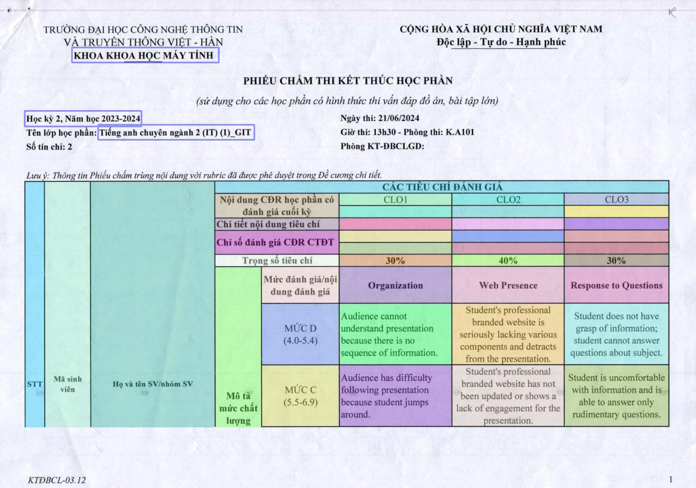

  <h1 style="text-align: center;">About the Project</h1>
  

    Hello, I'm Viet! This project was created to scan grade tables and generate results for VKU University, where I am currently studying. The goal is to streamline the process of entering grades for the academic affairs office. This project is a collaborative effort with the support of my team.
  

  <h2>How It Works</h2>
  <h3>1. Input the Image</h3>
  

    The process begins by uploading an image, typically a grade table. I utilize an optical model that scans the table to identify essential cells and headings, such as the class name, and returns their coordinates as shown in the image below:
  

  

    
  

  <h3>2. Extracting Data</h3>
  

    Once the necessary coordinates are obtained, the model uses these coordinates and employs VietOCR to scan the image. It then extracts the values along with their accuracy.
  

   

    
  

  

   Since the model is being fine-tuned to suit the grade tables of my university, you may need to make additional adjustments. Feel free to contact me if you encounter any issues.
  

